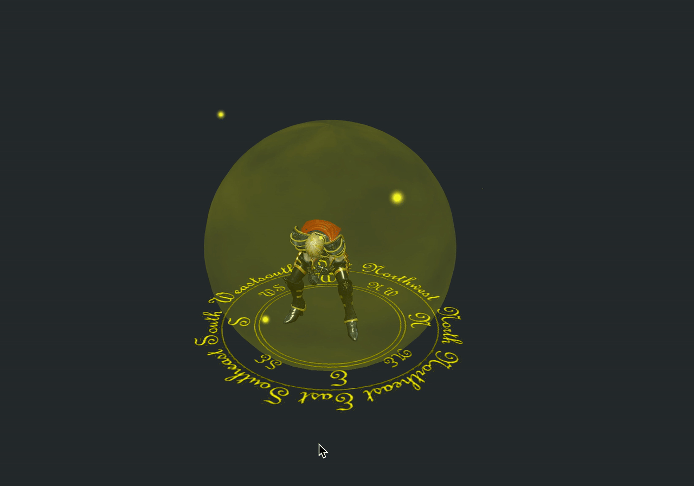
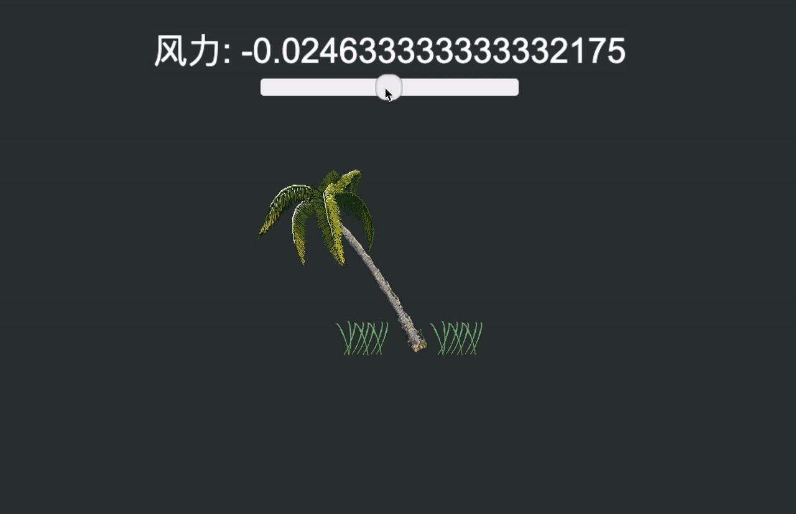
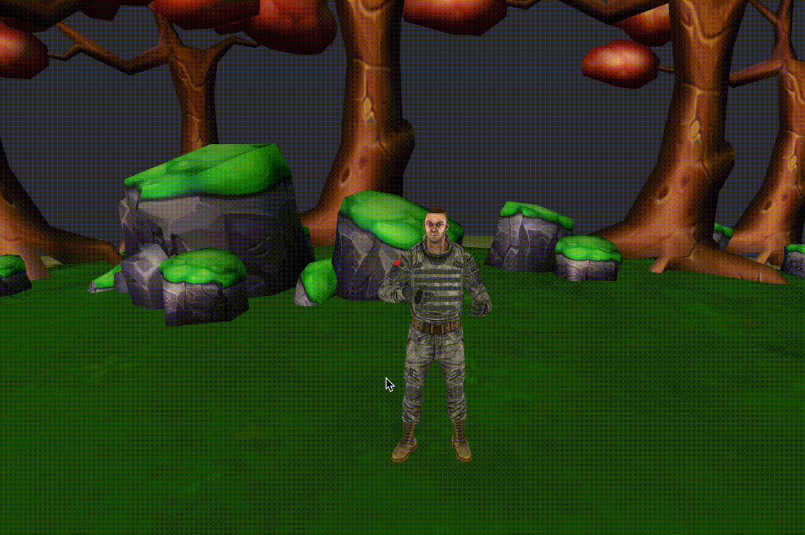
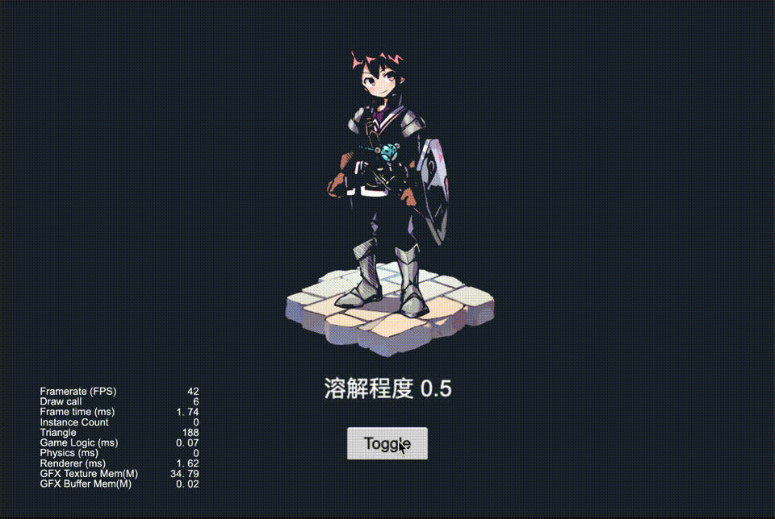

# CococsCreator 技术方案分享

 技术方案来源自论坛、github 开源仓库、gitee 开源仓库、热心开发者、Cocos 引擎开发团队、cocos 技术支持团队。

---
*Github 用户(ifengzp)提供，由技术支持团队升级至 3.4.1 版本*

* (v3.4.1) 圆形头像

  > 工程 git 仓库地址: 
  >
  > https://github.com/cocos/cocos-awesome-tech-solutions/tree/3.4.0-release/shader/Creator3.4.1_2D_Sprite_CircularAvatar
  >
  > 素材来自: 
  >
  > https://github.com/ifengzp/cocos-awesome/tree/master/assets/Scene/Circle_avatar
  
  

*Gitee 用户(carlosyzy)提供，由技术支持团队升级至 3.4.1 版本*

* (v3.4.1) 人物护盾

  > 工程 git 仓库地址: 
  >
  > https://github.com/cocos/cocos-awesome-tech-solutions/tree/3.4.0-release/shader/Creator3.4.1_3D_CharacterShield
  >
  > 素材来自: 
  >
  > https://gitee.com/carlosyzy/Creator3D_Shield/tree/master/project
  
  

*Github 用户(ifengzp)提供，由技术支持团队升级至 3.4.1 版本*

* (v3.4.1) 水面波纹

  > 工程 git 仓库地址: 
  >
  > https://github.com/cocos/cocos-awesome-tech-solutions/tree/3.4.0-release/shader/Creator3.4.1_2D_Sprite_WaterRipple
  >
  > 素材来自: 
  >
  > https://github.com/ifengzp/cocos-awesome/tree/master/assets/Scene/Water_spread
  
  

*Cocos Creator 中文论坛用户(ID: 468179984)提供，由技术支持团队升级至 3.4.1 版本*

* (v3.4.1) 植物受风摆动

  > 工程 git 仓库地址: 
  >
  > https://github.com/cocos/cocos-awesome-tech-solutions/tree/3.4.0-release/shader/Creator3.4.1_2D_Sprite_PlantsBlownByTheWind
  >
  > 素材来自: 
  >
  > https://forum.cocos.org/t/topic/123866
  
  

*Gitee 用户(carlosyzy)提供，由技术支持团队升级至 3.4.1 版本*

* (v3.4.1) 3D 噪声消融

  > 工程 git 仓库地址: 
  >
  > https://github.com/cocos/cocos-awesome-tech-solutions/tree/3.4.0-release/shader/Creator3.4.1_3D_NoiseAbatement
  >
  > 素材来自: 
  >
  > https://gitee.com/carlosyzy/Creator3D_Shader_Noise_Dissolve
  
  

*Gitee 用户(carlosyzy)提供，由技术支持团队升级至 3.4.1 版本*

* (v3.4.1) 图片噪声消融

  > 工程 git 仓库地址: 
  >
  > https://github.com/cocos/cocos-awesome-tech-solutions/tree/3.4.0-release/shader/Creator3.4.1_2D_Sprite_NoiseAbatement
  >
  > 素材来自: 
  >
  > https://github.com/ifengzp/cocos-awesome/tree/master/assets/Scene/Dissolve_color
  
  

*Github 用户(ifengzp)提供，由技术支持团队升级至 3.4.1 版本*

* (v3.4.1) 镜面光泽

  > 工程 git 仓库地址: 
  >
  > https://github.com/cocos/cocos-awesome-tech-solutions/tree/3.4.0-release/shader/Creator3.4.1_2D_Sprite_MirrorShine
  >
  > 素材来自: 
  >
  > https://github.com/ifengzp/cocos-awesome/tree/master/assets/Scene/Specular_gloss
  
  